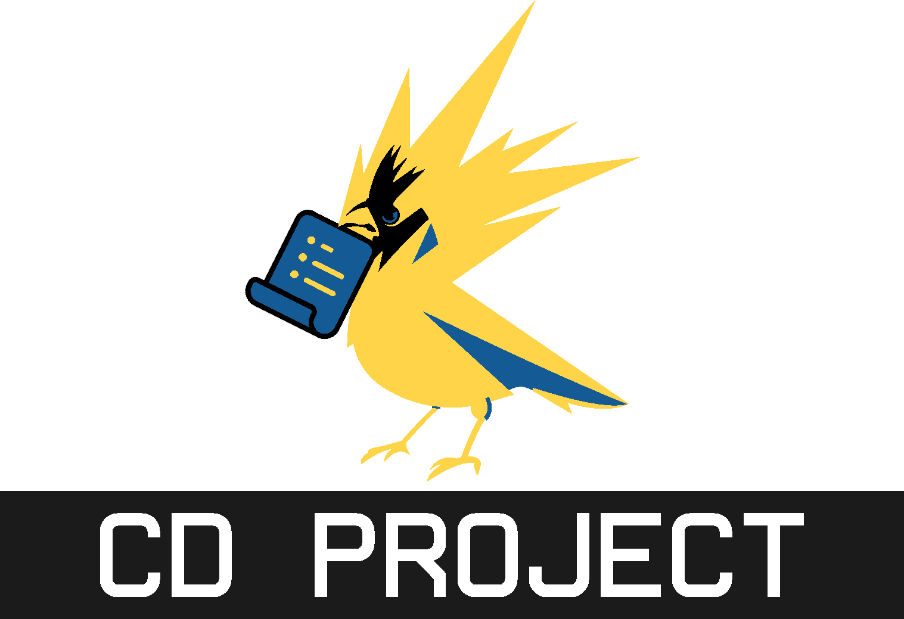
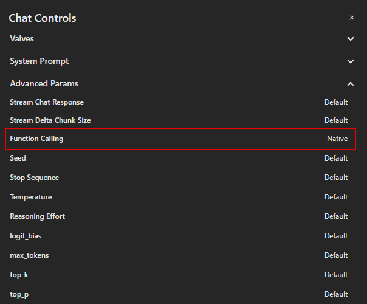

While working with Open WebUI, I noticed a significant gap: **ChatGPT can natively generate formatted documents, but most open-source models cannot.** This limitation became particularly frustrating when I needed to produce professional deliverables like reports, spreadsheets, and presentations directly from AI responses.

**CD ProJect** (Create Document from Python and Jupyter) solves this by giving *all* models in Open WebUI the ability to generate production-ready files. Instead of being limited to text output, your models can now create `.docx`, `.pdf`, `.xlsx`,  `.ppt`, `csv`, `markdown` and other formats through secure Python execution.

The implementation is straightforward but carefully designed:

<a href="#"></a>

- Jupyter runs in an isolated Docker container (no host system exposure)
- Document generation happens through standard Python libraries
- Files are delivered via a dedicated webserver with proper security
- All components integrate cleanly with Open WebUI

I built this specifically because I was tired of:

- Copying AI responses into Word/Excel manually
- Struggling with formatting issues
- Wishing my local models had ChatGPT's document capabilities

The setup requires few setups to get up and running (detailed in the documentation), but the trade-off is worth it: your models gain professional document creation abilities while maintaining enterprise security standards. If you've ever wished your local models could do what ChatGPT does with documents, this is for you.

---

# 🔄 Process Explained

Here’s how everything fits together step by step:

### 1. Tool

- The model generates Python code that creates files (e.g., `.docx`, `.pdf`, `.xlsx`).
- The code is wrapped and sent to the **Jupyter server** running inside Docker (default port: `8888`).

---

### 2. Jupyter Server

1. **Access Control**

   - The Jupyter server is **not publicly exposed (Local)**.
   - Only the tool can send code to it.
   - This means even if a remote user interacts with OpenWebUI, the Jupyter server remains isolated and secure.

2. **File Creation**

   - The Jupyter server executes the Python code.
   - Files are created inside Docker and stored in a volume mapped to a **host directory** (e.g., `jupyter_data/`).

3. **File URL Generation**

   - Once created, the tool provides a generated **download link**.

   - Example:

     ```
     https://openwebui.binarycells.com/backend-api/files/download?user_id=ce7aa5b1-0083-433e-acff-d2e5b3bda778&chat_id=7169d05f-2166-4b88-b176-ed9c5657c439&file_name=_EMHWczQxJzGp-EPdjoWJg.docx
     ```

---

### 3. Cloudflared (Cloudflare Tunnel)

- Cloudflared inspects requests for specific paths:

  ```
  /backend-api/files/*
  ```

- Matching requests are **redirected to the local file-serving webserver**.

---

### 4. Webserver

- The webserver parses query parameters from the request URL:

  ```
  ?user_id=ce7aa5b1-0083-433e-acff-d2e5b3bda778&chat_id=7169d05f-2166-4b88-b176-ed9c5657c439&file_name=_EMHWczQxJzGp-EPdjoWJg.docx
  ```

- Extracted key–value pairs:

  - `user_id` → `ce7aa5b1-0083-433e-acff-d2e5b3bda778`
  - `chat_id` → `7169d05f-2166-4b88-b176-ed9c5657c439`
  - `file_name` → `_EMHWczQxJzGp-EPdjoWJg.docx`

- The server uses this information to locate the file in the host and serve it securely.

---

# ⚙️ Set Up

## 1. Jupyter Setup (Docker)

Running Jupyter directly on the host is dangerous - it can execute arbitrary commands and modify files anywhere.  
**Solution:** run Jupyter in a Docker container with a mapped directory.

- **Safe:** Jupyter can only read/write inside the mapped folder (`jupyter_data`).
- **Isolated:** Host system files are never exposed.

⚠️ **Never run Jupyter directly on the host for this use case. Always use Docker.**

---

### 1. Create a Dockerfile

Create a file named `Dockerfile` (no extension) with:

```dockerfile
FROM jupyter/base-notebook:latest

# Install Pandoc (required for document conversions)
RUN apt-get update && apt-get install -y pandoc

# Install additional Python libraries for file generation
RUN pip install \
    python-docx \
    python-pptx \
    openpyxl \
    reportlab \
    fpdf2 \
    pdfplumber \
    pandas \
    pillow
```

---

### 2. Build the Docker Image

Run:

```bash
docker build -t IMG_NAME .
```

- `IMG_NAME` → a name for your Docker image (e.g., `jupyter-file-creator`).
- This command only needs to be run once unless you update the Dockerfile.

---

### 3. Prepare a Host Folder for Data

```bash
mkdir -p YOUR_HOST_DIRECTORY
```

- This folder will be mounted into the container at `/mnt/data`.
- All files created in Jupyter notebooks will appear here.
- Files outside this folder remain protected.

---

### 4. Run the Jupyter Server

```bash
# Optional: create a custom Docker network
docker network create NETWORK_NAME

# Run Jupyter inside Docker
docker run -it --rm --name CONTAINER_NAME --network NETWORK_NAME -p HOST_PORT:DOCKER_PORT -v YOUR_HOST_DIRECTORY:/mnt/data IMG_NAME jupyter lab --ip=0.0.0.0 --port=DOCKER_PORT --IdentityProvider.token=YOUR_TOKEN --no-browser
```

- `NETWORK_NAME` → your custom Docker network name (e.g., `jupyter-network`).  
  Omit `--network NETWORK_NAME` if you skipped network creation.
- `CONTAINER_NAME` → a name for the container (e.g., `jupyter-lab-container`).
- `HOST_PORT` → port on your machine (e.g., `8888`).
- `DOCKER_PORT` → port inside the container (usually `8888`).
- `YOUR_HOST_DIRECTORY` → full path to the folder created in [Prepare a Host Folder for Data](#3-prepare-a-host-folder-for-data).
- `IMG_NAME` → the Docker image built in [Build the Docker Image](#2-build-the-docker-image).
- `YOUR_TOKEN` → a secure token generated by the script below.  
  Must match the token configured in the tool.

```python
import hashlib
import base64

def generate_token_from_password(password):
    """
    Generate a token from a password
    Same password will generate the same token with 100 iterations
    """
    _password = password.encode("utf-8")
    
    for _ in range(100):
        key = hashlib.sha256(_password).digest()
        _password = base64.urlsafe_b64encode(key)
    token = base64.urlsafe_b64encode(key).decode("utf-8")

    return token

if __name__ == "__main__":
    password = input("Enter a password: ")
    token = generate_token_from_password(password)

    print(f"\nYour generated token: {token}")
    print("\nUse this as: --IdentityProvider.token=YOUR_TOKEN\n")
```

---

👍 Now, when the tool requests file creation:

1. Code runs in the isolated Jupyter container.
2. Files are getting stored in `YOUR_HOST_DIRECTORY`.
3. Now moving to → Cloudflare + webserver handle secure delivery of files.

---

## 2. Setting Up the Webserver

We'll use **FastAPI** to serve user-generated files.

#### Dependencies:

```bash
pip install fastapi uvicorn
```

> You can also install additional packages if needed for your environment.

---

#### Webserver Code:

```python
from fastapi import FastAPI, Request, HTTPException
from fastapi.responses import FileResponse
import uvicorn
import os

# === PLACEHOLDERS START ===
# Full path to the directory created in [Prepare a Host Folder for Data]
DIRECTORY = "PATH_TO_HOST_DIRECTORY"

# Port for the webserver (e.g., 8081)
PORT = PORT_NUMBER
# === PLACEHOLDERS END ===

# Create directory if it doesn't exist
if not os.path.exists(DIRECTORY):
    os.makedirs(DIRECTORY)

print(f"Serving files from: {DIRECTORY}")
print(f"Running on port: {PORT}\n")

app = FastAPI(
    title="Files API",
    description="API for serving user-generated files",
    version="0.1.0"
)

# Root endpoint
@app.get("/")
async def index():
    return {"message": "Welcome to the Files API."}

# Serve user-generated files
@app.get("/backend-api/files/download")
async def serve(request: Request):
    try:
        params = request.query_params
        user_id = params.get("user_id")
        chat_id = params.get("chat_id")
        file_name = params.get("file_name")

        print(f"Full URL: {request.url}")
        print(f"Query Params: {params}")

        if not user_id or not chat_id or not file_name:
            raise HTTPException(detail="Missing user_id, chat_id, or file_name parameter.", status_code=400)

        file_path = os.path.join(DIRECTORY, user_id, chat_id, file_name)
        print(f"Resolved file path: {file_path}")

        if not os.path.exists(file_path):
            raise HTTPException(detail="File not found.", status_code=404)

        return FileResponse(
            path=file_path,
            filename=file_name,
            media_type="application/octet-stream"
        )

    except Exception as e:
        raise HTTPException(detail=str(e), status_code=500)

if __name__ == "__main__":
    # Replace 'user_files_webserver' with your actual Python filename (without .py)
    uvicorn.run(
        "user_files_webserver:app",
        host="0.0.0.0",
        port=PORT,
        reload=False  # Set to True only for development
    )
```

**Placeholders explained:**

- `PORT_NUMBER` → port to run your file server (e.g., 8081).
- `PATH_TO_HOST_DIRECTORY` → full path to the directory created in [Prepare a Host Folder for Data](#3-prepare-a-host-folder-for-data) (e.g., `/opt/openwebui/jupyter_data`).

---

## 3. Serving Files with Cloudflared

If you **don’t have a domain** or don’t plan to use **Cloudflare tunnels** to serve files externally, skip to [Serving Files (Local)](#4-serving-files-local).

This section explains how to securely expose your local file server and OpenWebUI instance over the internet using **Cloudflared tunnels**.

---

### 1. Setting Up Cloudflared Tunnels

If you already have a tunnel, skip this step. Otherwise:

```bash
cloudflared tunnel login
cloudflared tunnel create TUNNEL_NAME
```

- `TUNNEL_NAME` → name for your tunnel (e.g., `my-secure-tunnel`).

This creates a `credentials.json` file:

- **Linux/macOS:** `~/.cloudflared/`
- **Windows:** `C:\Users\<YourUser>\.cloudflared\`

---

### 2. Expose Local Services via Docker

Create `docker-compose.yml`:

```yaml
version: "3.8"
services:
  cloudflared:
    image: cloudflare/cloudflared:latest
    container_name: CONTAINER_NAME
    restart: unless-stopped
    command: tunnel run
    volumes:
      - ./config.yml:/etc/cloudflared/config.yml
      - PATH_TO_CREDENTIAL_FILE:/etc/cloudflared/tunnel_credentials.json
    extra_hosts:
      - "host.docker.internal:host-gateway"
```

**Placeholders explained:**

- `CONTAINER_NAME` → Docker container name (e.g., `cloudflared-tunnel`).
- `PATH_TO_CREDENTIAL_FILE` → absolute path to `credentials.json` (e.g., `/home/user/.cloudflared/credentials.json`).

---

### 3. Cloudflare Tunnel Configuration

Create `config.yml`:

```yaml
tunnel: TUNNEL_NAME
credentials-file: /etc/cloudflared/tunnel_credentials.json

ingress:
  # Files webserver (local port 8081)
  - hostname: YOUR_DOMAIN
    service: http://host.docker.internal:WEBSERVER_PORT
    path: /backend-api/files/*

  # OpenWebUI service (local port 3000)
  - hostname: YOUR_DOMAIN
    service: http://host.docker.internal:OPEN_WEBUI_PORT
    path: /

  # Default: return 404 if no match
  - service: http_status:404
```

**Placeholders explained:**

- `TUNNEL_NAME` → must match the tunnel name from [Setting Up Cloudflared Tunnels](#1-setting-up-cloudflared-tunnels).
- `YOUR_DOMAIN` → your domain/subdomain (e.g., `llm.binarycells.com`).
- `WEBSERVER_PORT` → port of your local file server (e.g., 8081).
- `OPEN_WEBUI_PORT` → port of your local OpenWebUI instance (e.g., 3000).

---

### 4. Managing the Tunnel

**Start services:**

```bash
docker compose up --build -d
```

**Recreate containers:**

```bash
docker compose up --force-recreate -d
```

**Restart the tunnel:**

```bash
docker compose down
docker compose up -d
```

---

✅ Now your file server and OpenWebUI are securely exposed via Cloudflare with proper path routing.

---

## 4. Serving Files (Local)

In the tool set the `BASE_DOWNLOAD_URL` to `http://localhost:PORT_OF_THE_WEB_SERVER/backend-api/files/download`, where `PORT_OF_THE_WEB_SERVER` → the port configured in [Setting Up the Webserver](#2-setting-up-the-webserver) (e.g., 8081).

---

# Issues

- If the model is unable to recognize the tool, please set the `Function Calling` parameter to `Native` in OpenWebUI.
